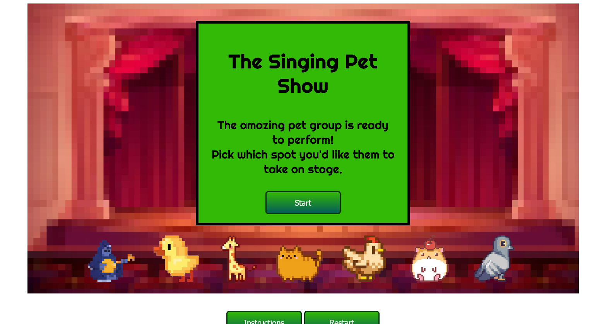

# The Singing Pet Show Music Mixer

Creating a Music Mixer called "The Singing Pet Show" where the magical pets in the land make sounds together that create music!

## Contributing

1. Fork it!
2. Create your feature branch: `git checkout -b my-new-feature`
3. Commit your changes: `git commit -am 'Add some feature'`
4. Push to the branch: `git push origin my-new-feature`
5. Submit a pull request :D

## Built with:
Basic css and html: Layout and simple CSS animation
 
Javascript: Drag and drop functions, play selected audio function and button functions.

## Credits

Lalaine - milkfirst
 
Abdullah - greatgrate1234

 
 
https://www.incredibox.com/

## License

MIT license
