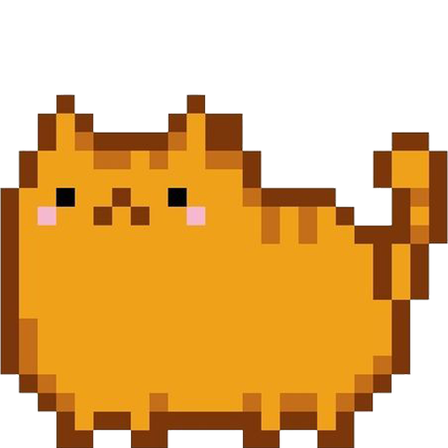
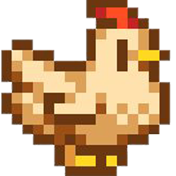

# Singing Dino Land the Music Mixer

Creating a Music Mixer called "Singing Dino Land" where the magical dinosaurs in the land make sounds altogether that create music!

## Contributing

1. Fork it!
2. Create your feature branch: `git checkout -b my-new-feature`
3. Commit your changes: `git commit -am 'Add some feature'`
4. Push to the branch: `git push origin my-new-feature`
5. Submit a pull request :D

## Credits

Me :)
 
